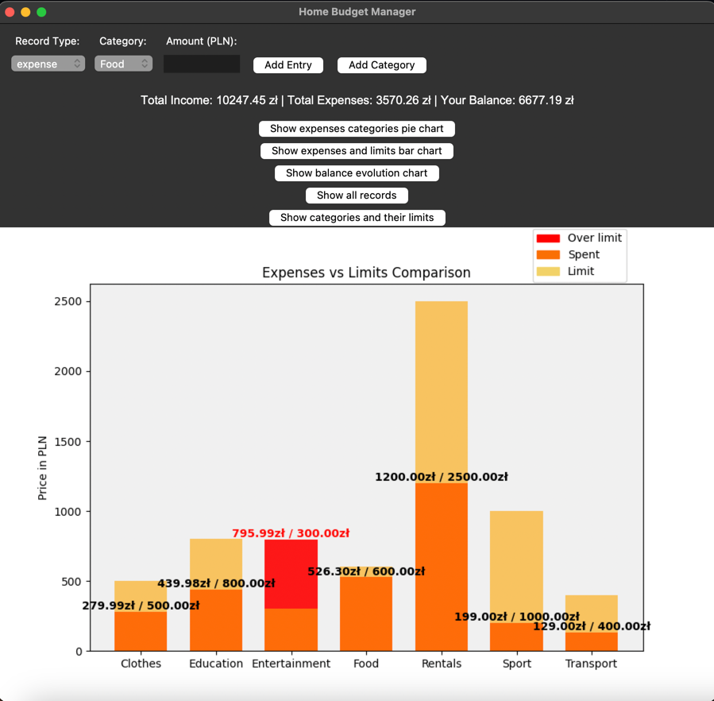
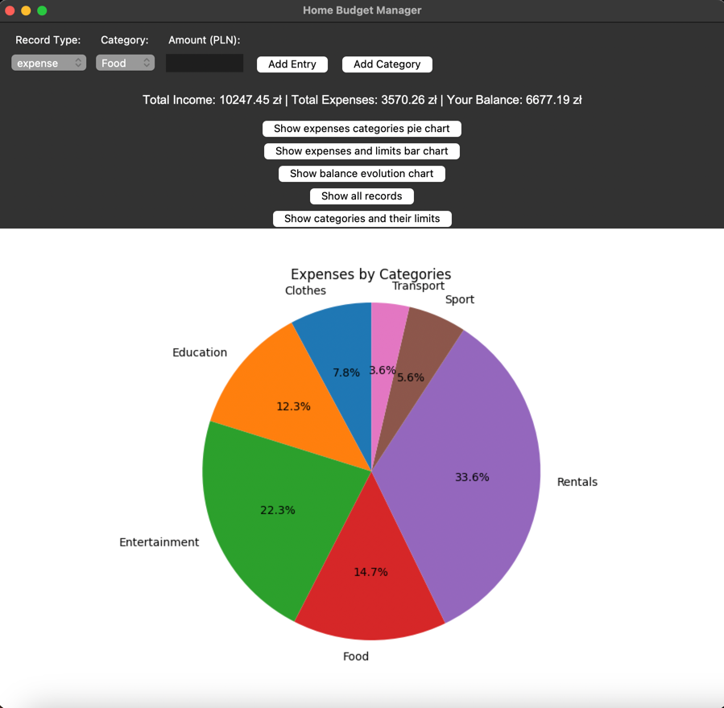
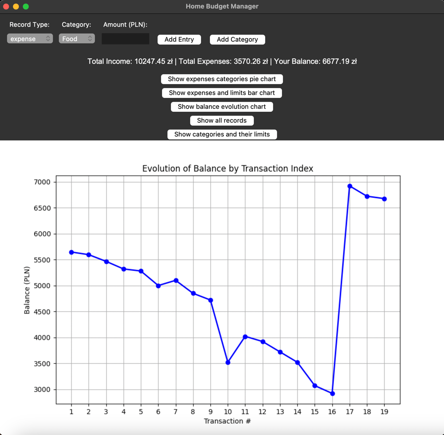

# **Final Project - Python Programming Academic Classes**

# Home Budget Manager

Home Budget Manager is an application created using the **Tkinter** library that allows users to manage their home budget. The application enables users to add expenses and incomes, track them across different categories, and visualize data in the form of charts and tables with records. Additionally, it offers an option to set limits for expense categories and view detailed financial data. All data is stored and managed using `.csv` files.

When the program is launched, if the files `budget_data.csv` and `categories.csv` are not found, they are automatically created with default values, allowing the user to start using the application immediately without manually adding data. The `budget_data.csv` file will contain only the column headers as the first record, while the `categories.csv` file will include sample categories with predefined limits. The data in both files can be edited during program execution as well as manually.

For example, after filling in or adding records, the files will look as follows:
(You can use these data to achieve nice effects in the charts)

**budget_data.csv**
```plaintext
Type,Category,Amount,Date,Description
income,Work Income,5647.45,2025-01-19,Salary from work
expense,Food,50.99,2025-01-19,Dinner
expense,Food,129.32,2025-01-19,Groceries
expense,Entertainment,145.99,2025-01-19,Cinema tickets
expense,Education,39.99,2025-01-19,Programming online course
expense,Clothes,279.99,2025-01-19,Jacket
income,Other,100.0,2025-01-19,Gift
expense,Education,249.99,2025-01-19,Educational books
expense,Transport,129.0,2025-01-19,Public transport
expense,Rentals,1200.0,2025-01-19,Flat rental
income,Work Income,500.0,2025-01-20,Monthly prize
expense,Food,100.0,2025-01-20,Dinner
expense,Food,200.0,2025-01-20,Groceries
expense,Entertainment,200.0,2025-01-20,Amusement park tickets
expense,Entertainment,450.0,2025-01-20,Concert tickets
expense,Education,150.0,2025-01-20,Online live webinars
income,Work Income,4000.0,2025-01-21,Best employee bonus
expense,Sport,199.0,2025-01-19,Gym membership
expense,Food,45.99,2025-01-19,Breakfast in cafe
```

**categories.csv**
```plaintext
Category,Limit
Food,600.0
Transport,400.0
Entertainment,300.0
Work Income,0.0
Other,200.0
Education,800.0
Clothes,500.0
Rentals,2500.0
Sport,1000.0
```

---

## Steps to Run the Application

#### Creating and Activating a Virtual Environment
```bash
python -m venv venv
source venv/bin/activate   # On Windows: venv\Scripts\activate
```

#### Installing Required Libraries from `requirements.txt`
```bash
pip install -r requirements.txt
```

#### Running the Application
```bash
python main.py
```

---

## `requirements.txt` File

(This file is located in the main project directory)
Below is the list of libraries required to run the application:

```plaintext
pandas==1.3.3
matplotlib==3.4.3
Pillow==8.4.0
```

---

## Application Features

1. **Adding Incomes and Expenses**

   - Option to choose the type of entry (income or expense).
   - Select a category from a dropdown list.
   - Enter the amount and optional description.
   - After adding an entry, the balance, total expenses, and charts are automatically updated.
   - Automatic check to verify if the balance is sufficient for the expense, along with a notification on whether the category limit has been exceeded or how much remains before exceeding it.

2. **Adding New Categories**

   - Create custom categories and set spending limits.
   - Automatically update the category list.

3. **Detailed Data Overview**

   - View current categories and their limits, total income and expenses, and current balance.
   - Display a table with records of entered incomes and expenses, as well as a table of categories and their limits.
     (Buttons: "Show all Records" and "Show Categories and their limits")

4. **Data Visualization**

   - Pie chart of expenses by category ("Show expenses categories pie chart").
   - Bar chart comparing expenses with set limits ("Show expenses and limits bar chart").
   - Line chart showing balance evolution over time ("Show balance evolution chart").

---

## Libraries Used and Their Purpose

1. **Tkinter**

   - Used to create the graphical user interface (GUI).
   - Handles windows, buttons, dropdown menus, and text fields.

2. **Pandas**

   - Stores and manages budget data in a DataFrame.
   - Handles CSV file operations (reading and writing).

3. **Matplotlib**

   - Generates charts (pie, bar, line).
   - Visualizes financial data in an easy-to-read format.

4. **Pillow**

   - Handles images generated by Matplotlib.
   - Converts charts to formats compatible with Tkinter.
---

## Some In-App screenshots



---



---



---
## Author

Kamil Piechota

